# :calendar:  Jarvis Task Manager - User Guide 

* [1. Introduction](#1-introduction)
* [2. Features](#2-features)
    + [2.1. Adding a task](#21-add-a-task)
    + [2.2. Marking a task done](#22-mark-task-as-done)
    + [2.3. Listing all tasks](#23-list)
    + [2.4. Find task by keyword](#24-find)
    + [2.5. Delete a task](#25-delete)
    + [2.6. Filter list by category](#26-filter)
    + [2.7. Clear all tasks](#27-clear)
    + [2.8. Viewing Help](#28-help)
- [3. Command Summary](#3-command-summary)       
     

## 1. Introduction

Jarvis is for those who *prefer to use a desktop app for managing their tasks*. More importantly, Jarvis is *strictly optimized for those who prefer to work with a Command Line Interface* (CLI). So, if you can type fast, you can rely on Jarvis to get your task management done much quicker than many other traditional apps out there. Enjoy! 

## 2. Features

*Command Format*
* Words in `UPPER_CASE` are the parameters to be supplied by the user e.g. in `todo [DESCRIPTION]`, `DESCRIPTION` is a parameter which can be used as `todo grab breakfast`.

&nbsp;

### 2.1 Add a task
With Jarvis, you can add 3 different types of tasks: todo, deadline and event.

#### 2.1.1 `todo` - Adds a todo task

A todo type of task will be added to the current task list.

Format: `todo [description]`

Example of usage:`todo read book`
> - Adds a todo task described as "read book" to the list

Expected outcome:

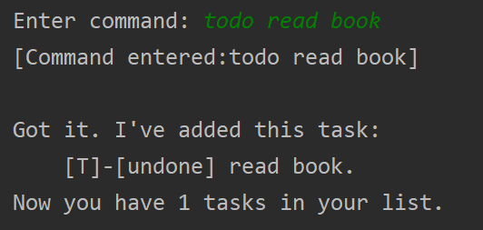

&nbsp;

#### 2.1.2 `deadline` - Adds a deadline task

A deadline type of task will be added to the current task list.

Format:
 `deadline [DESCRIPTION] /by [DUE DATE & TIME]`

> - Adds a deadline and its' due date to the list

> - **/by** signals start of `[DUE DATE & TIME]`

> - Accepted `[DUE DATE & TIME]` format:
>  + Year-Month-Day -- 24HR Time 
>     + e.g. **2020-03-02 1800** 
>   
>  + Any String value
>     + e.g. **June 6th** 

Example of usage:
`deadline project submission /by 2020-03-02 1200`

Expected outcome:

Example of usage:
`deadline return book /by June 6th`

Expected outcome:

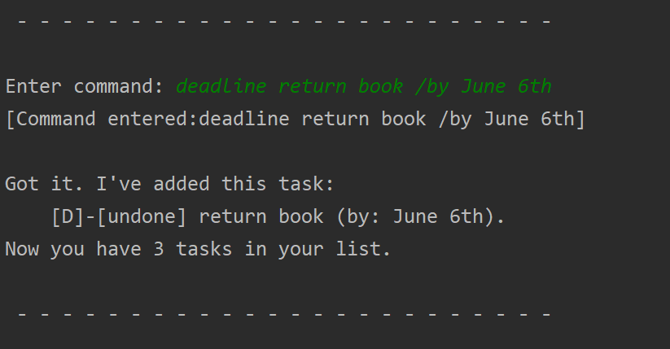

&nbsp;

#### 2.1.3 `event` - Adds a event task

An event type of task will be added to the current task list.

Format:
 `event [DESCRIPTION] /at [EVENT TIME & VENUE]`

> - Adds an event and its' event time and/or place to the list

> - **/at** signals start of `[EVENT TIME & VENUE]`

> - Accepted `[EVENT TIME & VENUE]` format:
>  + Year-Month-Day -- 24HR Time 
>     + e.g. **2020-03-02 1800** 
>   
>  + Any String value
>     + e.g. **at Julia's house tmr** 

Example of usage:
`event project meeting /at 2020-03-02 1200`

Expected outcome:

Example of usage:
`event party /at Julia's house tmr`

Expected outcome:

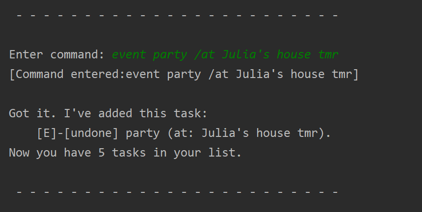

&nbsp;

### 2.2 Mark task as done
#### `done` - Mark done
Marks specified task as done.

Format:
 `done [INDEX]`

> - Deletes the item at the specified index.

>- The index refers to the index number shown in the displayed task list.

>- The index **must** be a positive integer 1, 2, 3, …

Example of usage:
`done 1`

Expected outcome:

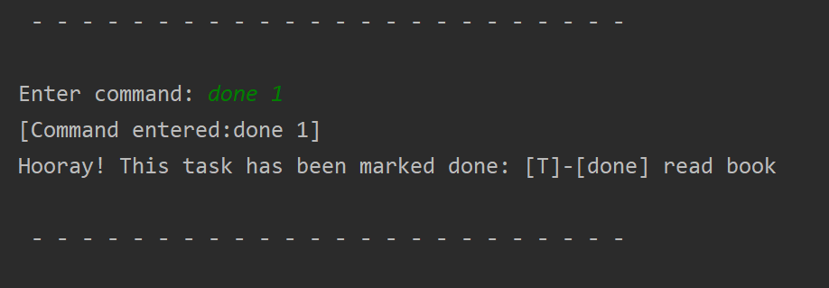

&nbsp;

### 2.3 List
#### `list` - Displays all tasks in list

Format:
 `list`

Example of usage:
`list`

Expected outcome:

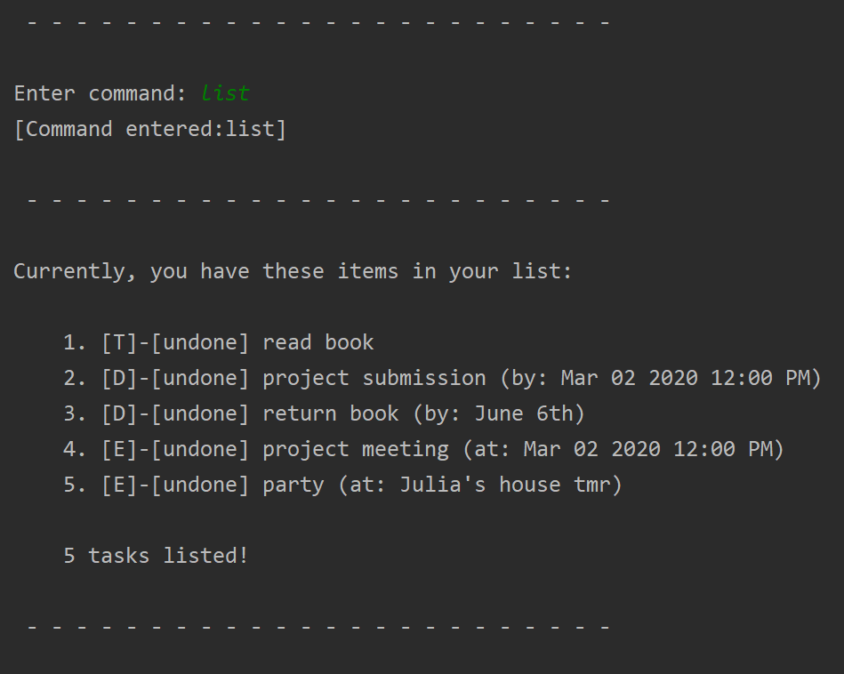

&nbsp;

### 2.4 Find 
#### `find` - Find tasks that match keyword
Find all tasks that match the given keyword

Format:
 `find [KEYWORD]`

> - `[KEYWORD]` is matched with task `description`.
> - Tasks with descriptions that have the `[KEYWORD]` are displayed. 

Example of usage:
`find book`

Expected outcome:

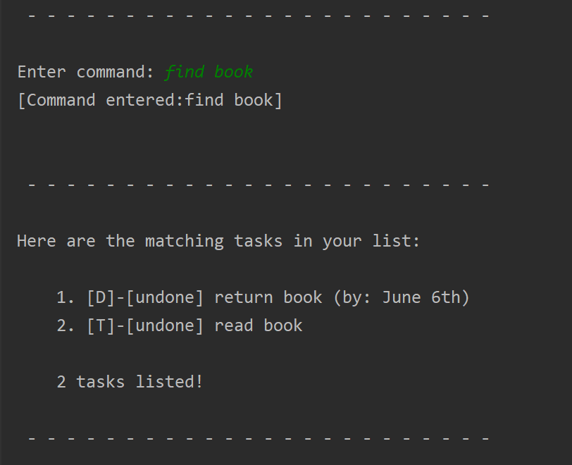

&nbsp;

### 2.5 Delete
#### `delete` - Deletes task from list
Deletes specified task from list.

Format:
 `delete [INDEX]`

> - Deletes the item at the specified index.

>- The index refers to the index number shown in the displayed task list.

>- The index **must** be a positive integer 1, 2, 3, …​

Example of usage:
`delete 1`

Expected outcome:

&nbsp;

### 2.6 Filter
Allows you to filter your task list by 3 different categories: task type, done status and date.

#### `filter` - Filters list according to category

The task list is filtered according to the given category.

Format: `filter [category]`
> - Accepted values for categories include: `"todo"`,`"event"`,`"deadline"`,`DATE`
>   - `DATE` **must** follow format: Month-Date
>     - e.g. Mar 02

Example of usage:`filter todo`
> - Displays all todo tasks in list

Expected outcome:

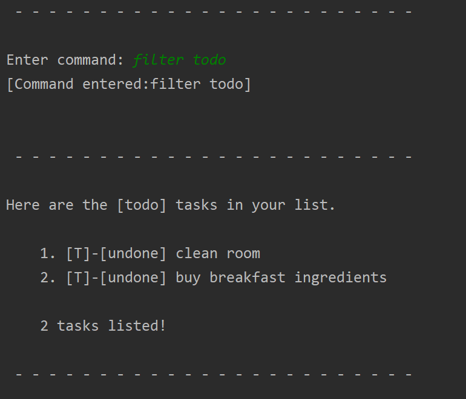

Example of usage:`filter deadline`
> - Displays all deadline tasks in list

Expected outcome:

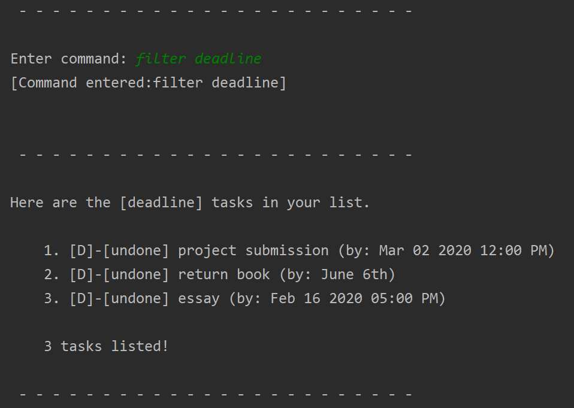

Example of usage:`filter event`
> - Displays all event tasks in list

Expected outcome:

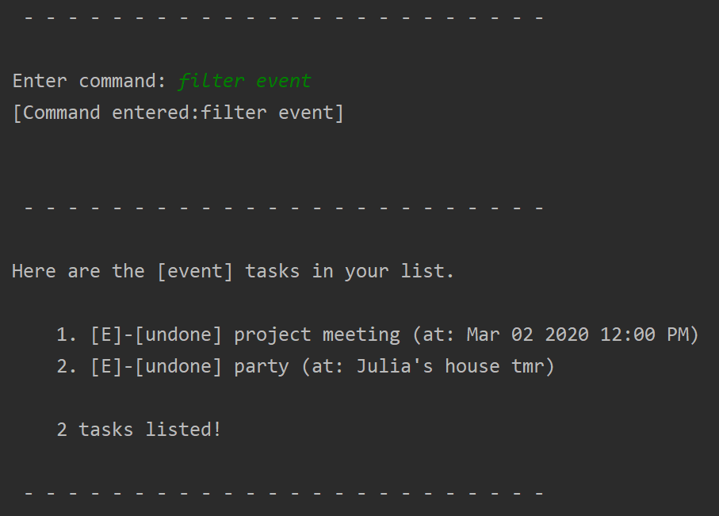

Example of usage:`filter DATE`
> - Displays all deadlines/events occurring on a specific date. 

| :bulb: | Jarvis is smart enough to list events/ deadlines occurring on the same day in chronological order! |

&nbsp;

### 2.7 Clear
#### `clear` - Clear all tasks in list
Clears and deletes **all** task in list

Format:
 `clear`

Example of usage:
`clear`

Expected outcome:

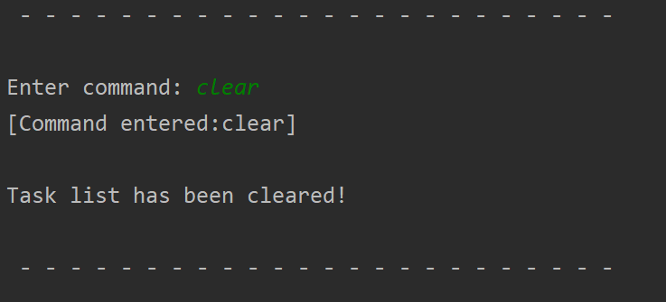

&nbsp;

### 2.8 Help
#### `help` - Displays a help list
The help list contains information about all accepted commands.

It will be displayed if the input command is invalid.

Format:
 `help`

Example of usage:
`help`

Expected outcome:

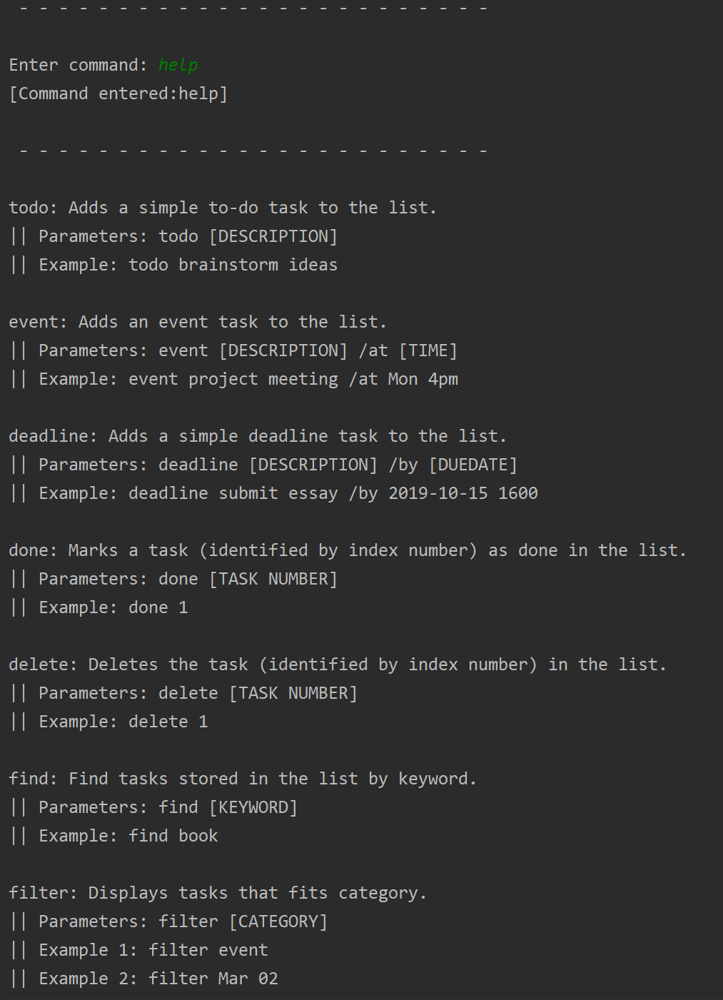

&nbsp;

### 2.9 Exit Program
#### `bye` - Exits the program
Saves task list to a local storage file in the computer and exits program.

Format:
 `bye`

Example of usage:
`bye`

Expected outcome:

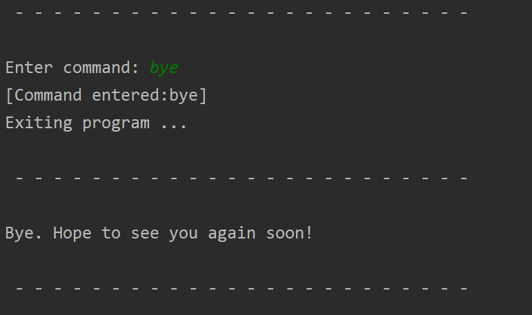

&nbsp;

## 3. Command Summary 

* *Todo* : `todo DESCRIPTION` 

    * e.g. `todo read book`

* *Deadline* : `deadline DESCRIPTION /by [DUE DATE & TIME]` 

    * e.g. `deadline project submission /by 2020-03-02 1200`   **OR**   `deadline return book /by June 6th`

* *Event* : `event DESCRIPTION /by [EVENT TIME & VENUE]` 

    * e.g. `event project meeting /at 2020-03-02 1200` **OR** `event party /at Julia's house tmr`

* *Mark* : `done [INDEX]`  
    * e.g. `done 1`

* *List* : `list` 

* *Find* : `find KEYWORD` 
    * e.g. `find book`

* *Delete* : `delete [INDEX]` 
    * e.g. `delete 3`

* *Filter* : `filter [CATEGORY]` 

    * e.g. `filter todo` **OR** `filter deadline` **OR** `filter event` **OR** `filter Mar 02`

* *Clear* : `clear`

* *Help* : `help`

* *Exit* : `bye`
